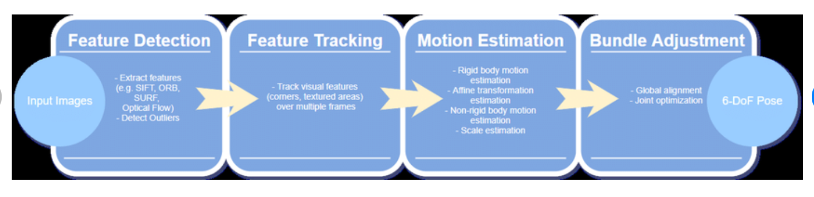

# PIPELINE VSLAM

Poses.txt :  Ground truth poses here that we can then calculate the error for from our estimated poses so we can also get an error and see how far are we from

we can just pass in our rotation matrix and also our translation matrix and then it will return a transformation and transformation matrix that we can then use to do operations on so basically 
#### the transformation matrix is our estimated pose at the end of the program here
